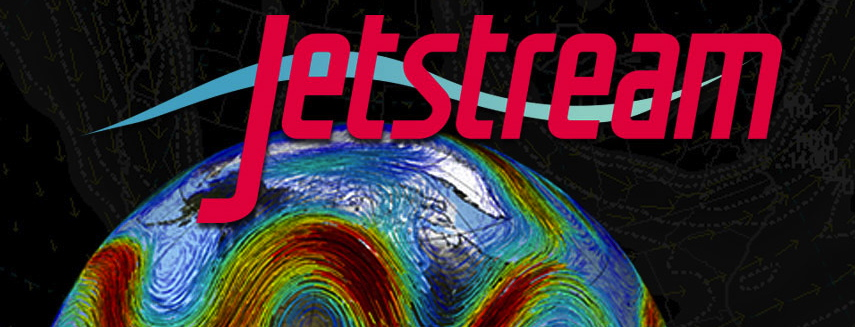

---?image=assets/imagery/merged.png&size=cover
<span style="font-weight: bold; font-size: 150%; color:#FFFF00">LEVERAGING CYVERSE FOR LARGE SCALE SPATIAL DATA ANALYSIS</span>

+++

#### October 27, 2017
#### Tyson Lee Swetnam
#### CyVerse Science Informatician

+++

### Contact Info

tswetnam@cyverse.org

github: tyson-swetnam

twitter: tswetnam

---

### Our Roadmap


<span style="font-family: courier; color:#ffffff">Emergence of Data Science & The Research Object </span> <!-- .element: class="fragment" -->

<span style="font-family: courier; color:#ffffff">Data Scientist Workbench examples </span> <!-- .element: class="fragment" -->

<span style="font-family: courier; color:#ffffff">Intro to CyVerse</span> <!-- .element: class="fragment" -->

<span style="font-family: courier; color:#ffffff">Containers & why you need them </span> <!-- .element: class="fragment" -->

<span style="font-family: courier; color:#ffffff">GIS in cloud and on HPC: Live Demo!!! _*DANGER ZONE*_ </span> <!-- .element: class="fragment" -->

---

### What does <span style="font-weight: bold; color: #118224">large-scale</span> really mean in the era of <span style="color: #3685E3">_big data_</span>?

+++

<span style="font-size: 150%; color:#ffffff">Data are always increasing in volume</span>

+++

<span style="font-weight: bold; font-size: 150%; color:#FF0000">90% </span><span style="font-size: 150%; color: #ffffff"> of all data in human history were created in the [last 24 months](https://blog.microfocus.com/how-much-data-is-created-on-the-internet-each-day/)</span>

+++

<span style="font-size: 150%; color:#ffffff">So, what qualifies as big data?</span>

@[0](<span style="font-size: 250%; font-weight: bold; color:#3685E3">Megabyte 10<sup><span style="font-size: 75%; font-weight: bold; color:#3685E3">6</span></sup>?</span>)
@[1](<span style="font-size: 250%; font-weight: bold; color:#0000FF">Gigabyte 10<sup><span style="font-size: 75%; font-weight: bold; color:#0000FF">9</span></sup>?</span>)
@[2](<span style="font-size: 250%; font-weight: bold; color:#0000A0">Terabyte 10<sup><span style="font-size: 75%; font-weight: bold; color:#0000A0">12</span></sup>?</span>)
@[3](<span style="font-size: 250%; font-weight: bold; color:#800080">Petabyte 10<sup><span style="font-size: 75%; font-weight: bold; color:#800080">15</span></sup>?</span>)
@[4](<span style="font-size: 250%; font-weight: bold; color:#00FF00">Exabyte 10<sup><span style="font-size: 75%; font-weight: bold; color:#00FF00">18</span></sup>?</span>)
@[5](<span style="font-size: 300%; font-weight: bold; color:#FF0000">data are just data</span>)

+++

Computing power and storage capacity are advancing at exponential rate

+++?image=assets/imagery/Moores_Law_over_120_Years.png&size=contain

<span style="color:#3685E3"> last 5 are all GPUs </span> 

---

## The Research Object

+++

<span style="font-size: 150%; color:#ffffff">Okay, what is a [Research Object](http://www.researchobject.org/)?</span>

@[1](<span style="font-size: 150%; font-weight: bold; color:#3685E3">broadly, it is a method for identification, aggregation, and exchange of scholarly information</span>)

+++
"_Supporting the publication of *more than just PDFs*, making *data*, *code*, and other resources *first class citizens of scholarship*_"

[Research Objects](http://www.researchobject.org/) have:

- Digital identity: DOI, <!-- .element: class="fragment" --> [ORCID](http://orcid.org/) <!-- .element: class="fragment" -->

- Annotation & Provenance <!-- .element: class="fragment" --> *METADATA!* <!-- .element: class="fragment" -->

Most importantly: they are discoverable & reusable <!-- .element: class="fragment" -->

+++

CyVerse covers the entire life cycle of the Research Object:

- Create
- Analyze
- Annotate
- Publish
- Archive

---

## Data Science "Workbenches"

+++

## Data scientists need a place to work...


+++

A workbench allows you to:
- Work in your preferred environment, languages, and libraries <!-- .element: class="fragment" -->
- Write in computational notebooks in Python, R, Spark, etc. <!-- .element: class="fragment" -->

+++

Popular Data Science Software

+++

 


+++

 

---

## What is [CyVerse](http://cyverse.org)? 


+++

<span style="font-weight: bold; color:#3685E3">Vision:</span> Transforming science through data driven discovery.</span>

+++

<span style="font-weight: bold; color: #3685E3">Mission:</span> To design, deploy, and expand a national cyberinfrastructure for life sciences research, and to train scientists in its use.</span>

+++

CyVerse is enabled by <span style="font-weight: bold; color: #c7232e">_people & research_</span>  <!-- .element: class="fragment" -->

CyVerse' existance depends on users innovating within an ecosystem of interoperability  <!-- .element: class="fragment" -->

+++

 

<span style="font-weight: bold; font-size: 150%; color:#FF0000">NOT!</span> <!-- .element: class="fragment" -->

+++

When scientists start using CyVerse <span style="font-weight: bold; color: #3685E3">we</span> work together to:

Develop your tools, workflows, and datasets

   

+++

In this talk I'll cover a few skill levels

+++

<span style="font-weight: bold; font-size: 150%; color:#FF0000">New users</span>

- Interest in Graphic User Interfaces (GUI) & Integrated Development Environment (IDE) tools <!-- .element: class="fragment" -->
  
  - Maybe just learning spatial analyses for the first time <!-- .element: class="fragment" -->

+++

<span style="font-weight: bold; font-size: 150%; color:#0000A0">Experienced users</span>

- Interest in scaling workflows beyond the laptop / desktop on to HPC and Cloud <!-- .element: class="fragment" -->

- Need to move significant amounts of data around networks <!-- .element: class="fragment" -->

+++

<span style="font-weight: bold; font-size: 150%; color:#800080">Power users</span>

- Interest in integrating global and national datasets across HPC environments for massively parallel computing <!-- .element: class="fragment" -->

---

### What does CyVerse offer today's data scientist?


---

## DataStore 


+++

- All new users receive 100 GB 
- Increase to 10 TB via portal request.
- \>10 TB available upon written request + executive review.

+++

Despite hosting several petabytes of data storage, CyVerse *is not* a canonical geospatial data repository, e.g. [Earth on AWS S3](https://aws.amazon.com/earth/).

+++

CyVerse *is* a place you can bring large quantities of data and do an analysis, generate more results data, and stage for a brief period (e.g. 6 months to 2 years), before moving those data to canonical or privately hosted repositories.

+++

### Data Store upload/download

+++

- CyVerse uses a system called [iRODS](https://irods.org/)
  - Multi-threaded file transfer 
- GUI via the [Discovery Environment](https://de.cyverse.org)
- Mountable as a local file directory via FUSE
- Extendable API for developers via *[Agave](http://www.cyverse.org/science-apis)*

+++

### [CyberDuck](https://cyberduck.io/)


[Setting up CyberDuck with CyVerse DataStore](https://pods.iplantcollaborative.org/wiki/display/DS/Using+Cyberduck+for+Uploading+and+Downloading+to+the+Data+Store)

+++

<span style="color: #e49436">using iCommands</span>
<br>

```shell
$ ils
$ imkdir
$ iinit
$ iget -KPbrv /iplant/home/tyson_swetnam/rstudio_data/ ~/home/$USER/Downloads/
$ iput -KPrv ~/home/$USER/Documents/rstudio_demo.rmd /iplant/home/tyson_swetnam/data
```

@[1]([iCommands](https://pods.iplantcollaborative.org/wiki/display/DS/Using+iCommands) uses standard Linux commands, e.g. `ls` is `ils`)
@[2](Create a folder on the DataStore)
@[3](initiate the connection to an iRODS account)
@[4](`get` files from the DataStore. Flags `-` with `K` ensures data are not corrupted, `P` provide feedback, `b` bulk transfer, `v` verbose, `r` recursive through entire folder )
@[5](`put` files onto the DataStore.)

---

## [Atmosphere](https://cyverse.org/atmosphere)


+++

- Linux environment (Centos, Ubuntu)
- On demand
- Collaborate together online
- Publically host custom images

+++

- Multiple 'flavors' of instance size
  - 1 CPU, 4GB RAM, 30GB Disk
  ...
  - 16 CPU, 128GB RAM, 1400GB Disk
- Attach (and detach) additional TB size volumes to an instance   
- emulated web shell and desktop via [Apache _Guacamole_](https://guacamole.incubator.apache.org/)  

+++

Atmosphere proved to be very popular...

+++

...so we built



+++?image=/assets/imagery/Jetstream_topology_diagram-crop.png&size=95%

+++

- co-located at Texas Advanced Computing Center (TACC) and Indiana University (IU)
- launch dozens of instances 
- sizes from 1 core 2GB RAM, up to 44 CPU, 120GB RAM
- Request necessary storage size

---

## [Data Commons](https://dc.cyverse.org)


+++

[DOI](https://www.doi.org/) is a Digital Object Identifier 

[ARK](https://en.wikipedia.org/wiki/Archival_Resource_Key) is an Archival Resource Key.

Both identifiers are issued by CyVerse through the California Digital Library's [EZID service](http://ezid.cdlib.org/).

+++

- Publish your notebooks 
- datasets
 - Recieve a DOI
 - Searchable

---

## [Discovery Environment](https://de.cyverse.org)


+++


- Easily add any command-line tool or any executable into the tool list
- create or edit a new customized interface or create a sequenced workflow by chaining one app to another in automated workflow.
- Use application programming interfaces (APIs)

+++

Bring your own tools to the Discovery Environment


[Devisetty et al. 2016](https://f1000research.com/articles/5-1442/v1) 

---

## [Bisque](https://bisque.cyverse.org)


+++

[BisQue](https://bisque.cyverse.org) is an image analysis platform 

+++

- segmentation
- annotation
- metadata tagging

+++?image=assets/imagery/Operations_menu.png&size=90%

+++?image=assets/imagery/BisQue_image_calibration.png&size=90%

+++?image=assets/imagery/Image_size_bar.png&size=90%

+++?image=assets/imagery/Canopy_coverage_counter.png&size=90%

+++

#### Coming soon

+++

- Machine Learning
- Structure from Motion

---

## [Learning Center](http://learning.cyverse.org/en/latest/) 


+++

Next week's webinar - [Getting Started with CyVerse](http://www.cyverse.org/blog/events/webinar-get-started-cyverse-november-2017)

---

#### [To Infinity, and Beyond!](https://agaveapi.co/platform/)


---

## Containers

+++

*different OS + third party software + frequent changes and updates + deployment and reproducibility issues* = 
 
<span style="font-weight: bold; font-size: 150%; color:#FF0000">_Dependency Hell_</span> <!-- .element: class="fragment" -->

 <!-- .element: class="fragment" -->

+++

Solution: Containerize your software, run anywhere. 

+++


+++

Why Containerize?

- Dependencies can be wicked problems <!-- .element: class="fragment" -->
- Compiling software is slow <!-- .element: class="fragment" -->
- Reproducability is hard <!-- .element: class="fragment" -->
- Portability <!-- .element: class="fragment" -->

+++

## Containers for HPC


[Singularity](http://singularity.lbl.gov)

+++

- Shares _most_ of the host environment
  - all mounted volumes
- `root` privileges inside container
  - install your own software on HPC!
- Build your own image or use a Dockerfile

+++

#### Want to learn more about Scientific Research with containers?

_Advanced Workshop hosted by CyVerse_

Feb 29 - March 2, 2018 (exact dates TBA)

Location: University of Arizona Tucson, AZ

---

## GIS

+++

The majority of data ([59%](http://www.tandfonline.com/doi/abs/10.1080/13658816.2012.743664)) include a spatial component or are themselves inherently spatial.

+++

Environmental Systems Research Institute (ESRI), est. 1969

 

+++

ESRI dominates the US GIS marketplace and is used widely by gov't and in academia.

+++

Geographic Resources Analysis Support System (GRASS), est. 1982 by US Army Corps of Engineers


+++

Open Source Geospatial Foundation (OSGEO)


+++

A large open source GIS community exists and is growing.

+++


+++


+++

Which GIS platform is best for CyVerse?

@[1](<span style="font-size: 150%; font-weight: bold; color:#3685E3">They are all great & no one platform is going to fit all of your needs </span>)

---

### using Licensed software with CyVerse

+++

ArcGIS is the most widely used GIS software in the USA, ~40% of all users.

+++

[ArcGIS Portal 10.5](http://server.arcgis.com/en/portal/latest/install/linux/welcome-to-the-portal-for-arcgis-installation-guide.htm) runs in Linux

- install on Atmosphere / Jetstream instances using [Chef](https://github.com/Esri/arcgis-cookbook)
 - must use license keys issued via your institution
- Integrated with [Docker and Project Jupyter](https://hub.docker.com/r/esridocker/arcgis-api-python-notebook/) 
 - run notebooks with ArcPy and the ArcGIS API to do big data applications 

--- 

## Demo

+++

#### Building the best Virtual Machine for your research


+++

#### Setting up Atmosphere instances as Data Science Workbenches

+++

Create a new instance

If you are planning to "image" the instance, select the smallest functional size.

Install new software into `/opt` `/srv`

+++

@title[EZ Install]

### <span style="color: #e49436">EZ Install</span>
<br>

```shell
$ ez
$ ezd
$ ezs
$ ezj -R -3
```

@[1](View option menu for `ez`)
@[2](Install latest version of Docker)
@[3](Install latest version of Singularity)
@[4](Install Anaconda and Jupyter Notebooks w/ Python3 and the R Kernel)

---

@title[Anaconda]

### <span style="color: #e49436">Anaconda and Jupyter Notebook</span>
<br>

```shell
$ ezj -3
$ sudo chown $USER:iplant-everyone /home/anaconda3 -R

Done!
```

@[1](Install Anaconda and Jupyter Notebooks w/ Python3 and R Kernel)
@[2](Change ownership of the Anaconda directory so that you can install new kernels)
@[4](Open Jupyter via provided URL w/ token)

---

@title[ArcGIS Jupyter Notebook with Docker]

### <span style="color: #e49436">Docker + Jupyter + ArcPy</span>
<br>

```shell
$ ezd
$ usermod -aG docker $USER
$ exit
$ docker run -it -p 8888:8888 esridocker/arcgis-api-python-notebook

Done!

```

@[1](Install latest version of Docker using `EZ` installation)
@[2](Add yourself to the Docker group on your VM so you can run without `sudo`)
@[3](exit and restart terminal)
@[4](Pull the ArcGIS Jupyter Docker Container)
@[6](The Jupyter notebook should now be running on the localhost - change `localhost` out for the VM's IP address)

---


+++

@title[Docker RStudio]

### <span style="color: #e49436">Docker + RStudio</span>
<br>

```shell
$ ezd
$ sudo usermod -aG docker $USER
$ exit
$ docker pull rocker/geospatial
$ docker run -d -p 8787:8787 rocker/geospatial

Done!

```

@[1](install Docker)
@[2](change `sudo` privileges)
@[3](exit and restart terminal window)
@[4](pull the Rocker/Geospatial Rstudio-Server from DockerHub)
@[5](Run the Container in detached mode `-d` on port `-p 8787:8787`)
@[7](Open the Instance's IP address w/ port number in a new browser window)

+++


---

#### What about other file storage services?

+++

* Google Drive FUSE Client: [`google-drive-ocamlfuse`](https://github.com/astrada/google-drive-ocamlfuse)
* Google Drive `Go` Client: [`drive`](https://github.com/odeke-em/drive)

Coming Soon: [Syndicate](https://github.com/syndicate-storage)

---

## Multi-container jobs with Makeflow

+++

How do I scale my research to use hundreds to thousands of computers?


+++?image=assets/imagery/eemt_github.PNG&size=auto 95%

+++?image=assets/imagery/eemt_singularity.png.png&size=auto 95%

---

#### Where do I get started, if I don't know where to start?

[The Carpentries](https://software-carpentry.org/)
