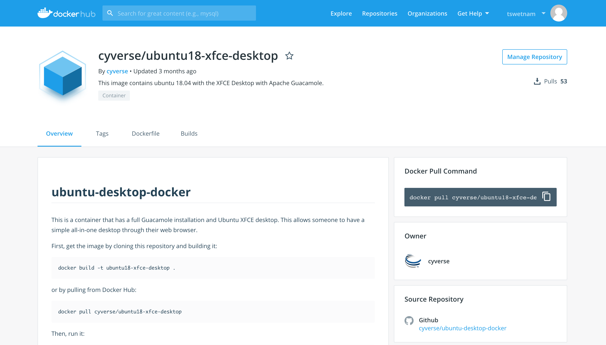
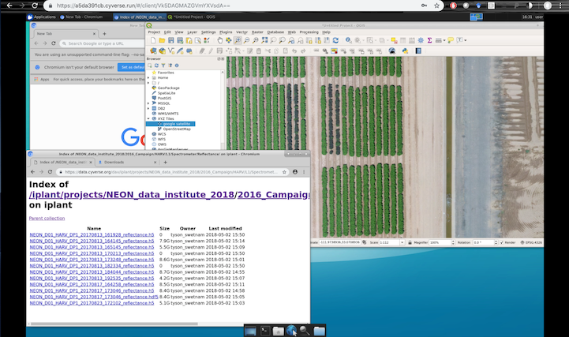
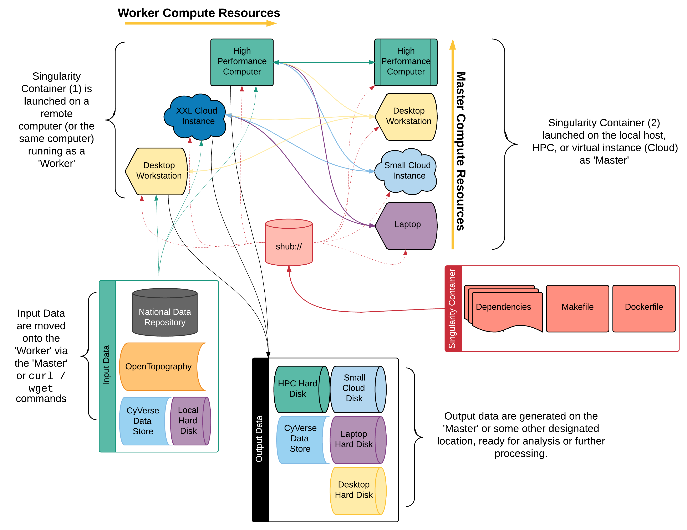
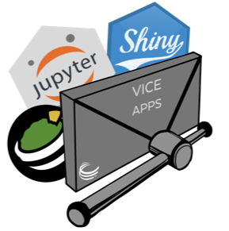
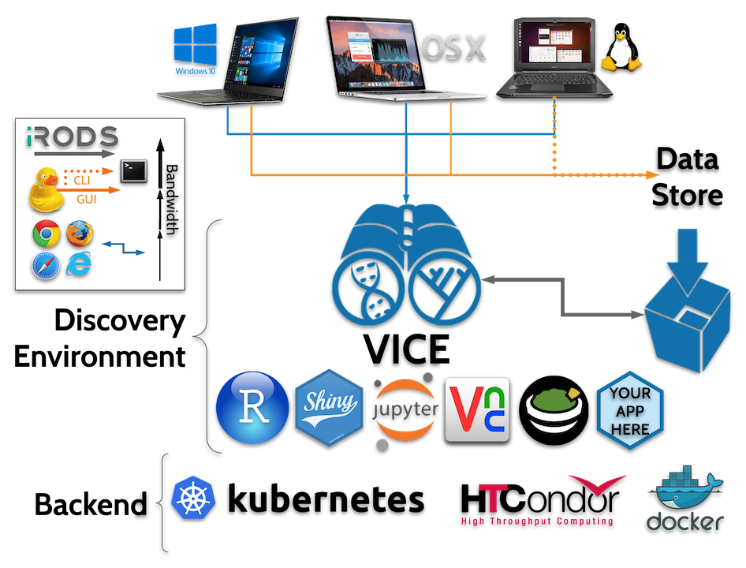

---

<span style="font-weight: bold; font-size: 170%; color:#FFFF00">Going Places with Your Container(s)</span>

February 8, 2019
#### Tyson Lee Swetnam


+++

### My Contact Info

email: tswetnam@cyverse.org

github id: [tyson-swetnam](https://github.com/tyson-swetnam) & [cyverse-gis](https://github.com/cyverse-gis)

twitter: tswetnam

---

### Today's Roadmap


<span style="font-size: 80%; color:#F9FF33">Review of two weeks ago: "Make Your Life (and Analyses) Easier with Containers" </span> <!-- .element: class="fragment" -->

<span style="font-size: 100%; color:#58FF33">Building your own container</span> <!-- .element: class="fragment" -->

<span style="font-size: 100%; color:#58FF33">Have Container(s), Will travel </span> <!-- .element: class="fragment" -->

---

### [Make your life and analyses easier with Containers](https://github.com/julianpistorius/presentation-containers-intro)

#### Presented by Julian Pistorius

+++   

## Pitfalls when working in bespoke software and environments

+++

*different OS + third party software + updates/upgrades + redeployment* = <span style="font-weight: bold; font-size: 100%; color:#FF0000">_Dependency Hell_</span> <!-- .element: class="fragment" -->
 
 <!-- .element: class="fragment" -->  <!-- .element: class="fragment" -->

+++

## Solution: Containerize the software, run it anywhere. 

 <!-- .element: class="fragment" -->

+++

## Why Containerize?

- Dependencies turn into wicked problems <!-- .element: class="fragment" -->
- Compiling software is sloooowww <!-- .element: class="fragment" -->
- Reproducibility is hard across platforms <!-- .element: class="fragment" -->
- Portability <!-- .element: class="fragment" --> **& _Scalability_** <!-- .element: class="fragment" -->

+++

## Which software should you use?


+++
### DOCKER


+++

### Singularity


+++

## Choosing the right container

- <span style="font-weight: bold; font-size: 80%; color:#55FF33">Find one that already exists on https://hub.docker.com/</span>
- <span style="font-weight: bold; font-size: 80%; color:#F9FF33">Modify an existing container by adding new dependencies</span> 
- <span style="font-weight: bold; font-size: 80%; color:#FF0000">Create your own from scratch</span>

+++

# Building your own Docker Containers

+++
## <span style="color: #e49436">Create a Dockerfile</span>
<br>

```shell
FROM ubuntu:18.04
MAINTAINER "Tyson Lee Swetnam" tswetnam@cyverse.org
RUN apt-get update && apt-get install -y fortune cowsay lolcat
ENV PATH=/usr/games:${PATH}
ENV LC_ALL=C
ENTRYPOINT fortune | cowsay | lolcat

```

@[1](FROM a image base, e.g. alpine, centos, debian, ubuntu, I use Ubuntu Bionic Beaver 18.04)
@[2](Add in who the person was who created the container - not required)
@[3](RUN a set of scripts, here an update and installation of three programs)
@[4](Set the environment, adding the three new games to the PATH)
@[5](Use the default language)
@[6](the ENTRYPOINT is what will happen when the container is run)

+++

@title[DOCKER]

## <span style="color: #e49436">Build your Docker container</span>
<br>


```shell
$ sudo docker build -t tswetnam/cowsay:latest .
$ docker run -it tswetnam/cowsay:latest 
$ docker run --rm -it --entrypoint /bin/bash tswetnam/cowsay:latest 
$ fortune | cowsay | lolcat
$ docker push tswetnam/cowsay:latest

Done!
```

@[1](Use `sudo` to build the image with a tag name)
@[2](Run new image using the interactive and TTY flags)
@[3](Start a bash shell inside the container - note: you're inside the container now)
@[4](Run the programs from inside the container)
@[5](Push your container to DockerHub)
@[7](Done!)

+++

## Containers for HPC


[Singularity](http://singularity.lbl.gov)

+++


- Shares the host environment and file system
- Same username & `root` privilege inside container
- Build your own image or use an existing Docker container

+++

## <span style="color: #e49436">Writing a Singularity file</span>
<br>

```shell
BootStrap: docker
From: ubuntu:18.04

%help
  "This container tells a joke" 
%post
  apt-get -y update
  apt-get -y install fortune cowsay lolcat
%environment
  export LC_ALL=C
  export PATH=/usr/games:$PATH
%runscript
  fortune | cowsay | lolcat
```

@[1](Select an image repository - could be `docker`, `shub`, or `yum`)
@[2](Image hosted on Docker Hub - Ubuntu Bionic Beaver 18.04)
@[4,5](`%help` is a simple help text)
@[6,7,8](`%post` command runs Bash commands like `apt-get` to install dependencies or programs)
@[9,10,11](`%environment` settings, exporting paths for where to look for the commands)
@[12,13](`%runscript` execute scripts in the container)

+++

@title[Singularity]

## <span style="color: #e49436">Build your Singularity Image</span>
<br>

```shell
$ sudo singularity build cowsay.simg Singularity
$ singularity run cowsay.simg
$ singularity exec cowsay.simg fortune | cowsay | lolcat
$ singularity shell cowsay.simg
$ fortune | cowsay | lolcat
$ singularity run docker://tswetnam/cowsay:latest

Done!
```

@[1](Use `sudo` to build the image with your Singularity file)
@[2](Run new image)
@[3](Execute the programs in the container)
@[4](Start a bash shell inside the container - note: you're inside the container now)
@[5](Run the programs)
@[6](Pull the Docker version of the container and run it with Singularity!)
@[8](Done!)

---

# Lessons Learned in building containers

+++

[Alan Perlis, 1982 Epigrams on Programming](https://web.archive.org/web/19990117034445/http://www-pu.informatik.uni-tuebingen.de/users/klaeren/epigrams.html)

**54. Beware of the Turing Tarpit in which everything is possible but nothing of interest is easy.**


+++

## Building the "best" containers often takes time and experience


---

## Have Container(s), Will Travel


+++

## Example Use Cases

+++

<span style="font-weight: bold; font-size: 150%; color:#FF0000">Graphical User</span>

- Works in Graphic User Interfaces (GUI) & with Integrated Development Environments (IDE) <!-- .element: class="fragment" -->
  
- Needs more computing power than their laptop <!-- .element: class="fragment" -->

- Cannot afford to buy a $5,000 workstation <!-- .element: class="fragment" -->

+++



+++



+++

<span style="font-weight: bold; font-size: 150%; color:#F0FF00">Power User</span>

- Interest in scaling workflow beyond the laptop / desktop onto HPC and Cloud <!-- .element: class="fragment" -->

+++



+++


+++

<span style="font-weight: bold; font-size: 150%; color:#FFAA00">Millions of Containers</span>

- Leveraging containers for massively parallel computing <!-- .element: class="fragment" -->

+++

   


3 million jobs = 7 million CPU hours = 1 PhD 

[Read here about Ariella's work with OSG & Pegasus](https://pegasus.isi.edu/2018/12/10/pegasus-helped-ecology-and-evolutionary-biology-graduate-student-at-the-university-of-arizona-shed-light-on-human-population-history/) 

---


# Working on CyVerse

+++

### CyVerse is enabled by <span style="font-weight: bold; color: #c7232e">_People & Research Objectives_</span>  <!-- .element: class="fragment" -->

### Our success depends on users innovating within an ecosystem of interoperability  <!-- .element: class="fragment" -->

+++

 

<span style="font-weight: bold; font-size: 150%; color:#FF0000">NOT!</span> <!-- .element: class="fragment" -->

+++

### When you begin using CyVerse <span style="font-weight: bold; color: #3685E3">WE</span> work with you to identify your tools, workflows, and datasets

   

+++

### How can you use containers within CyVerse?

+++

## [Atmosphere](https://cyverse.org/atmosphere)


## On demand cloud computing for scientific research

+++


- Linux environment (CentOS, Ubuntu)
- Collaborate together online
- Publicly host custom images

+++


- Multiple instance sizes and 'flavors'
  - 1 CPU, 4GB RAM, 30GB Disk
  up to 
  - 16 CPU, 128GB RAM, 1400GB Disk
- Attach (and swap) external storage volumes    
- emulated web shell and desktop via [Apache _Guacamole_](https://guacamole.incubator.apache.org/)  


+++

## Installing Popular Container software on CyVerse Atmosphere


+++

@title[EZ Install]

## <span style="color: #e49436">EZ Install</span>
<br>

```shell
$ ez
$ ezd
$ ezs
$ ezj -R -3
$ ezjh
```

@[1](View option menu for Ansible `ez`)
@[2](Install latest version of Docker)
@[3](Install latest version of Singularity)
@[4](Install Anaconda and Jupyter Notebooks w/ Python3 and the R Kernel)
@[5](Install a Jupyter-Hub with CyVerse CAS)

+++

 

```shell
$ ezd -p
$ sudo usermod -aG docker $USER
$ exit
$ docker pull rocker/geospatial:latest
$ docker run --rm -d -p 8787:8787 -e PASSWORD=password rocker/geospatial:latest

Done!

```

@[1](install Docker and Portainer.io)
@[2](change `sudo` privileges)
@[3](exit and restart terminal window)
@[4](pull the latest version of Rocker Geospatial RStudio-Server from DockerHub)
@[5](Run the Container in detached mode `-d` on port `-p 8787:8787`)
@[7](Runs RStudio-Server in the background, open it in a new browser tab)

+++

## [Discovery Environment](https://de.cyverse.org)


+++


- Add your own Docker containers as "Tools"
- Build "Apps" with interfaces for users (equivalent command-line interface execution)
- Create a sequenced workflow by chaining one app to another in an automated workflow.
- Use application programming interfaces (APIs)

+++

Bring your own Docker Containers into the Discovery Environment

[Devisetty et al. 2016](https://f1000research.com/articles/5-1442/v1)


+++

### Visual Interactive Computing Environment (VICE)



+++



---

### Want to learn more?


+++

### [The Learning Center](http://learning.cyverse.org/en/latest/) 

 

+++

### Container Camp

#### March 6-8, 2019
##### Location: University of Arizona, Tucson AZ

https://www.cyverse.org/cc

+++

### Foundational Open Science Skills (FOSS)
#### June 3–14, 2019
##### Location: University of Arizona, Tucson AZ

https://www.cyverse.org/foss


---

## Acknowledgments

Thank you David Godlove & Sylabs for the fortune telling cows.

Thanks Julian Pistorius, Upendra Devisetty, and Nirav Merchant (CyVerse) for slide help.

Thanks Mats Rynge (ISI) and OpenScienceGrid. 

+++


 
 
 

 

##### Grants No. DBI-0735191, DBI-1265383, & DBI-1743442.
